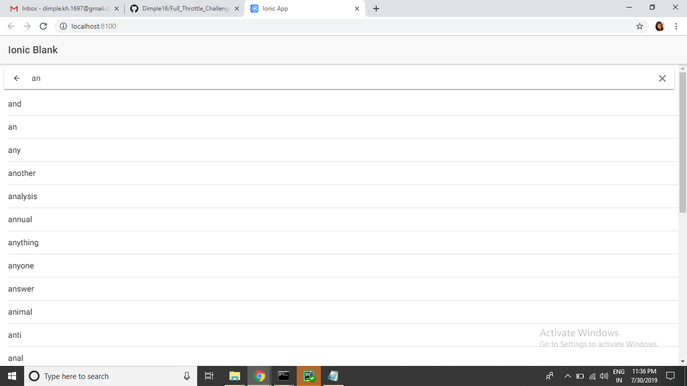

# Full Throttle Challenge
>This repo contains the application build using the Django framework.
>Repo contains the functionality of autocomplete by suggesting the possible words that can be derived from user input. 
>The results presented are limited to 25 queries only.

# Pre-Requisite
1. Install Python3 (refer to https://www.python.org/downloads/ for more details on Installation).
2. Install Django Framework using pip. Run command `pip install -e django\` for windows. For more installtion guide refer to link https://docs.djangoproject.com/en/2.1/topics/install/ 
3. Install node.js for running the client-side application.
4. Install Ionic Framework. Refer to https://ionicframework.com/docs/intro/installation for installation instructions.

# Run server

1. Clone the repository
2. After cloning the repository, head to the fullThrottle folder
3. Run `python manage.py runserver 8080` to run the server
4. For the Client side application head to the frontend folder and run command "ionic serve".
5. This runs the appplication which allows the user to enter the text in searchbox (As in Screenshot-2) to receive autocomplete suggestion. (It takes a while to load)
6. While the server runs, the request and response can be viewed on the terminal. (Screenshot-1)
7. The data is fetched from the database provided.

# Screenshots

